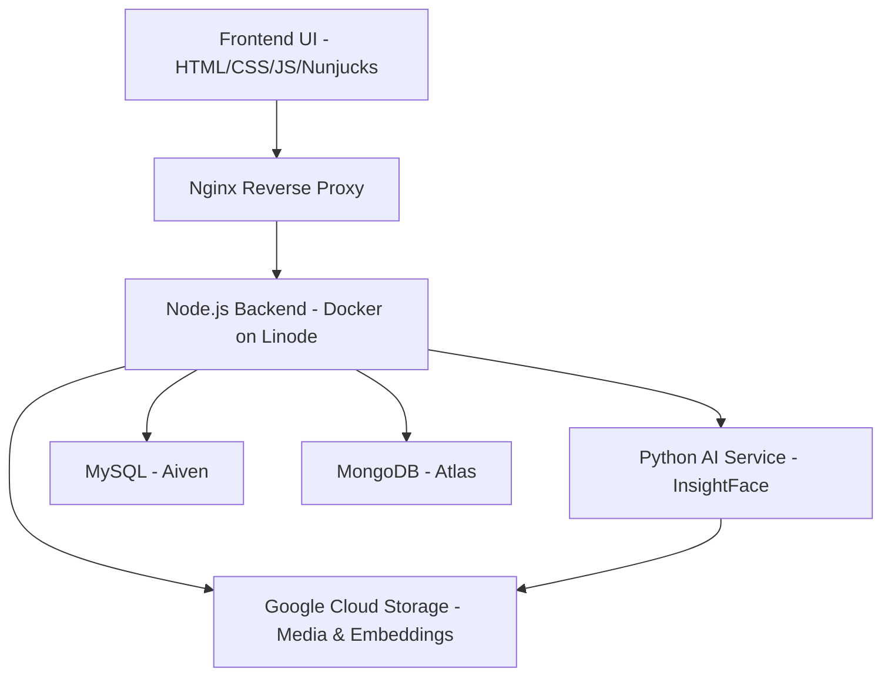

# 🚀 Sohojia Foundation Monitoring System

<p align="center">
  
</p>

<p align="center"><strong>A web-based volunteer and activity monitoring system built to support the Sohojia Foundation's mission of providing education and extracurricular activities to rural students.</strong></p>

---

## 📖 Table of Contents

* [About The Project](#about-the-project)
* [Key Features](#key-features)
* [Architecture Overview](#architecture-overview)
* [Tech Stack](#tech-stack)
* [Getting Started](#getting-started)
* [Deployment & Nginx Configuration](#deployment--nginx-configuration)
* [Security & Privacy](#security--privacy)
* [Development Notes](#development-notes)
* [Troubleshooting & FAQs](#troubleshooting--faqs)
* [Contributing](#contributing)
* [License](#license)
* [Acknowledgments & Contributors](#acknowledgments--contributors)

---

## 📖 About The Project

The **Sohojia Foundation Monitoring System** is a web-based volunteer and activity monitoring platform built for the Sohojia Foundation — a nonprofit working in remote areas of West Bengal, India. The system replaces manual oversight with a lightweight, privacy-conscious automation stack: location-aware schedules, biometric verification, role-based access control, automated reporting, and media management.

**🎯 Vision:** Bring scientific thinking, quality education, and creative expression to underserved rural communities.

**🤝 Mission:** Provide reliable monitoring tools so the Foundation can scale education and extracurricular programs while keeping operational overheads low.

**Key chapters & programs:**

* **Amader Pathshala (Sirjan Chapter)** — Barshi village, Bankura; includes the Bigyanusandhan Kendra (Science Center).
* **Sokaler Pathshala (Bandwan Chapter)** — Launched in 2023; morning study sessions serving 60+ students.
* **Creative Arts & Annual Events** — Exhibitions and performances showcasing student work.

---

## ✨ Key Features

1. 🔐 **Hierarchical Role-Based Access Control (RBAC)**

   * Roles: `Admin` → `Center Programme Director` → `Center Programme Coordinator` → `{Volunteer, Event Manager}` → `Student`.
   * HttpOnly JWT cookies, bcrypt password hashing, and granular middleware permissions (`middleware/authJwt.js`).

2. 👥 **Advanced Volunteer & Staff Management**

   * Unified profile system: promote volunteers without duplicating data; dashboard edits sync across roles.
   * Dynamic onboarding and account lifecycle (activate/deactivate/archive).

3. ✅ **Multi-Factor Attendance Verification**

   * 📍 Location-based check-in (configurable radius, default 100 m).
   * 😊 Face verification via a Python microservice (InsightFace `buffalo_l` model + ONNX Runtime).
   * 👆 Fingerprint/WebAuthn for passwordless biometric check-ins.
   * 📂 Secure media & embedding storage in Google Cloud Storage.

4. 🗓️ **Comprehensive Schedule & Holiday Management**

   * Create day/shift/subject schedules with GPS coordinates.
   * Seasonal schedule switching via cron.
   * Holiday rules that interact with absence logic.

5. 🎉 **Event & Activity Reporting**

   * Custom event types (e.g., Karate, Painting, Science Fair).
   * Media uploads and filterable/exportable reports.

6. 🤖 **Automated Cron Jobs**

   * Absence checking, lateness tracking (default threshold 15 minutes), and season switching.

---

## 🏗️ Architecture Overview

The project uses a hybrid microservice-oriented architecture: a monolithic Node.js backend for business logic and a Python microservice for face recognition.



---

## 🛠️ Tech Stack

<p align="center">
 


</p>

---

## 🚀 Getting Started

### Prerequisites

* Git
* Node.js v18+ and npm
* Python 3.10+
* pip
* Docker & Docker Compose (recommended)

### Installation

```bash
git clone https://github.com/Saikat-dot678/sohojia-foundation.git
cd sohojia-foundation
```

### Environment configuration

Create a `.env` file in the project root. Copy `.env.example` and fill in credentials.

> ⚠️ Do **not** commit `.env` to the repository. It's already included in `.gitignore`.

**Example `.env` (skeleton):**

```env
# Server
PORT=3000
NODE_ENV="development"

# MySQL (Aiven)
SQL_HOST=your_sql_host
SQL_PORT=your_sql_port
SQL_USER=your_sql_user
SQL_PASS=your_sql_password
SQL_DATABASE=sohojia_foundation
MYSQL_CA_PATH=path/to/your/ca.pem

# MongoDB (Atlas)
MONGO_URI=your_mongodb_atlas_connection_string

# Session & JWT
SESSION_SECRET=a_very_long_and_random_session_secret
JWT_SECRET=another_very_long_and_random_jwt_secret
JWT_EXPIRES_IN=2h

# Default admin
ADMIN_USERNAME=admin
ADMIN_PASSWORD=a_strong_and_secure_password

# Google Cloud Storage
GOOGLE_APPLICATION_CREDENTIALS=path/to/your/gcloud_service_account.json
GCLOUD_PROJECT=your_gcloud_project_id
BUCKET1=your-primary-image-bucket-name
BUCKET2=your-embeddings-bucket-name
```

### Install dependencies

```bash
# Node.js backend
npm install

# Python service
pip install -r python-service/requirements.txt
```

### Run (Recommended)

**Docker Compose:**

```bash
docker-compose up --build
```

**Manual (dev):**

1. Start databases (local or cloud).
2. `npm run dev` (or `node server.js`) for Node backend.
3. `python python-service/app.py` for Python AI service.

---

## ☁️ Deployment & Nginx Configuration

The production environment runs as Docker containers on Linode, proxied by Nginx. Example Nginx config:

```nginx
# /etc/nginx/sites-available/your_domain.com

server {
    listen 80;
    server_name your_domain.com www.your_domain.com;
    location / { return 301 https://$host$request_uri; }
}

server {
    listen 443 ssl http2;
    server_name your_domain.com www.your_domain.com;

    client_max_body_size 10M;

    ssl_certificate /etc/letsencrypt/live/your_domain.com/fullchain.pem;
    ssl_certificate_key /etc/letsencrypt/live/your_domain.com/privkey.pem;
    ssl_protocols TLSv1.2 TLSv1.3;
    ssl_prefer_server_ciphers on;

    access_log /var/log/nginx/your_domain.access.log;
    error_log /var/log/nginx/your_domain.error.log;

    location / {
        proxy_pass http://localhost:3000; # Node.js app
        proxy_http_version 1.1;
        proxy_set_header Upgrade $http_upgrade;
        proxy_set_header Connection 'upgrade';
        proxy_set_header Host $host;
        proxy_cache_bypass $http_upgrade;
        proxy_set_header X-Real-IP $remote_addr;
        proxy_set_header X-Forwarded-For $proxy_add_x_forwarded_for;
        proxy_set_header X-Forwarded-Proto $scheme;
    }
}
```

### Obtaining an SSL certificate (Let's Encrypt / Certbot) 🔐

On Ubuntu with snap:

```bash
sudo snap install --classic certbot
sudo ln -s /snap/bin/certbot /usr/bin/certbot
sudo certbot --nginx
```

Test and reload nginx after certbot completes:

```bash
sudo nginx -t
sudo systemctl reload nginx
```

---

## 🔒 Security & Privacy

* **Authentication:** JWT tokens stored in secure, HttpOnly cookies. 🔐
* **Password Storage:** Passwords hashed with `bcrypt`. 🛡️
* **Biometric Data:** Facial images and embeddings are sensitive — keep buckets private, use IAM service accounts, and rotate keys. 🧬🔑
* **Data Retention:** Configure retention & archival policies according to Foundation policy and regulations. 🗄️📑

---

## ⚙️ Development Notes

* **AI Service:** Python microservice exposes `/generate-embedding` and `/verify-face`, using InsightFace + ONNX Runtime for inference. 🤖
* **Data model:** MySQL for relational entities (users, roles, schedules), MongoDB for logs, embeddings metadata, and large objects. 🗃️
* **File uploads:** Multer streams uploads to Google Cloud Storage. ☁️📤
* **Cron jobs:** `node-cron` handles absence checks, lateness, and season switching. ⏰🔁

**Recommended local workflow:**

1. Start DB services.
2. `npm run dev` for backend.
3. Run Python AI service.
4. Open UI and create test users & schedules. 🌐

---

## 🛠️ Troubleshooting & FAQs

**Q: Face verification failing for many users?**

* Ensure Python service is running and has GCS access. 🔎
* Confirm each user has sufficient images for embeddings (10 recommended). 📸
* Inspect AI service logs for ONNX or file-read errors. 📝

**Q: Cron jobs not running?**

* Ensure `node-cron` is active and only one process handles scheduled jobs in production. ⚠️

**Q: File upload size errors?**

* Increase `client_max_body_size` in Nginx and adjust Multer limits. 📦

---

## ✨ Contributing

Contributions are welcome!

1. Fork the repo 🍴
2. Create a branch: `git checkout -b feat/my-feature` 🌿
3. Commit: `git commit -m "feat: describe your change"` 📝
4. Push & open a Pull Request 🔁

Please follow the code style and add tests when possible.

---

## 📜 License

This project is licensed under the **MIT License**. See the `LICENSE` file for details.

---

## 🙏 Acknowledgments & Contributors

Special thanks to the open-source projects and platforms that made this possible:

* Node.js, Express.js
* Python, InsightFace, ONNX Runtime
* Docker & Docker Compose
* MySQL (Aiven), MongoDB Atlas
* Google Cloud Storage
* Linode

**Authors & Maintainers**

* Saikat-dot678 — Project Lead & Developer

If you'd like to help, please open an issue or contact the maintainers.

---

*Thank you for supporting the Sohojia Foundation — together we can make quality education accessible to more children in rural communities.* ❤️
